[](https://travis-ci.org/ibartomeus/traitmatch)

# traitmatch: Package to predict trait matching from species interactions.

This document reproduces the analysis done in Bartomeus et al. 2015 (Functional Ecology) to show how it works.

To install the package run (only once):


```r
install.packages("devtools") 
```

```
## 
##   There is a binary version available (and will be installed) but
##   the source version is later:
##          binary source
## devtools  1.9.1 1.10.0
## 
## 
## The downloaded binary packages are in
## 	/var/folders/p4/d9_l6vqs0jdf5f1cyk7cy4sc0000gp/T//RtmpZIx1tt/downloaded_packages
```

```r
install.packages("GenSA") 
```

```
## 
## The downloaded binary packages are in
## 	/var/folders/p4/d9_l6vqs0jdf5f1cyk7cy4sc0000gp/T//RtmpZIx1tt/downloaded_packages
```

```r
install.packages("SDMTools") 
```

```
## 
## The downloaded binary packages are in
## 	/var/folders/p4/d9_l6vqs0jdf5f1cyk7cy4sc0000gp/T//RtmpZIx1tt/downloaded_packages
```

```r
require(devtools)
```

```
## Loading required package: devtools
```

```
## Warning: package 'devtools' was built under R version 3.1.3
```

```r
install_github("traitmatch", "ibartomeus")
```

```
## Warning: Username parameter is deprecated. Please use ibartomeus/traitmatch
```

```
## Downloading GitHub repo ibartomeus/traitmatch@master
```

```
## Installing traitmatch
```

```
## '/Library/Frameworks/R.framework/Resources/bin/R' --no-site-file  \
##   --no-environ --no-save --no-restore CMD INSTALL  \
##   '/private/var/folders/p4/d9_l6vqs0jdf5f1cyk7cy4sc0000gp/T/RtmpZIx1tt/devtools54ef54bc663/ibartomeus-traitmatch-37d9818'  \
##   --library='/Library/Frameworks/R.framework/Versions/3.1/Resources/library'  \
##   --install-tests
```

```
## 
```

```r
require(traitmatch)
```

```
## Loading required package: traitmatch
```

```
## Loading required package: GenSA
```

```
## Warning: package 'GenSA' was built under R version 3.1.3
```

We first use data on predator and prey body size from Barnes et al. 2008. We load the data and logtransform it. The original data is multiplied by 10 to avoid problems with the integral of the normal distribution


```r
# Load data for Pred/Prey
#fish <- read.table("data/Barnes2008.txt", header = TRUE)
fish <- Barnes2008
  
# Each row represents an interaction
head(fish) 
```

```
##   standardised_predator_length si_prey_length
## 1                       93.990        11.2590
## 2                       95.195         8.4443
## 3                      100.020        10.5950
## 4                       34.945         9.3301
## 5                       31.330         8.6900
## 6                       33.740         8.1465
```

```r
# Define the vectors for the predator and prey size
MPred = log10(fish$standardised_predator_length*10)
MPrey = log10(fish$si_prey_length*10)
```

Then we fit the `integrated_model` that integrates neutral and niche constraints. We use pairwise Prey-Predatory interactions (Tlevel vectors) and we asume that the distribution of preys is well characterized by this network (we use mean and standard deviation directly from the distribution of prey interactions). Here we constrain the parameters with a priori information. For example, the slope of the relationship has to be positive (the bigger the predator, the bigger the prey). Tuning the a priori assumptions is important to get good estimates of the parameters. With unconstrained estimates (MLE), some model optimization will struggle to find maximum likelihood estimates and yield erroneous parameter estimates, such as a vertical slope. It is therefore critical to check that the results make sense before accepting them as the MLE. This process is slow, especially for large datasets like this one. You can use the max.time (in seconds) to cut the process to e.g. 900 seconds (15 minutes). The default is 30 minutes. Note that the estimates can be bad if too little time is allowed for the simulated annealing (SA) to converge. 


```r
?fit_it
mt <- 60 #Define max.time to 60 sec to run things fast. Set to minimum 900 for a decent estimation of parameters.
pars_pre <- fit_it(integrated_model, 
                   Tlevel1 = MPrey,  
                   Tlevel2 = MPred,
                   mean_Tlevel1 = mean(MPrey),
                   sd_Tlevel1 = sd(MPrey),
                   pars = c(a0 = 0, a1 = 0, b0 = 0, b1 = 0),
                   par_lo = c(a0 = -10, a1 = 0, b0 = -10, b1 = -10),
                   par_hi = c(a0 = 10, a1 = 10, b0 = 10, b1 = 10),
                   max.time = mt)
```

```
## It: 1, obj value: 21223.05852
## .
## It: 1001, obj value: 21223.05832
## ...
## It: 1013, obj value: 21223.05831
## .
## It: 1017, obj value: 21223.05825
```

```r
pars_pre 
```

```
## [1] -2.3883887  1.5453309  0.3103664  0.1050232
```

We can plot the predicted model:


```r
# With this model, the first estimate is the intercept and second number the slope.

?plot_pred
plot_pred(pars = pars_pre, Tlevel1 = MPrey, 
          Tlevel2 = MPred, xlab = "log (Predator body size)", 
          ylab = "log (prey body size)", pch = ".")
```

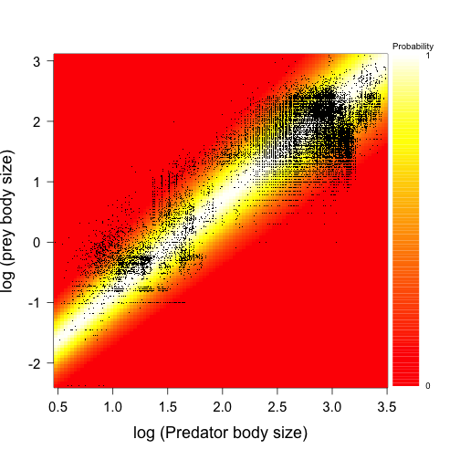

You may want to compare that with a pure niche model (not taking into account the abundances). We can fit the niche models as follow:


```r
pars_pre_niche <- fit_it(niche_model,
                         Tlevel1 = MPrey, 
                         Tlevel2 = MPred,
                         mean_Tlevel1 = mean(MPrey),
                         sd_Tlevel1 = sd(MPrey),
                         pars = c(a0 = 0, a1 = 0, b0 = 0, b1 = 0),
                         par_lo = c(a0 = -10, a1 = 0, b0 = -10, b1 = -10),
                         par_hi = c(a0 = 10, a1 = 10, b0 = 10, b1 = 10),
                         max.time = mt)
```

```
## It: 1, obj value: 28353.96313
## .
## It: 1001, obj value: 28353.96305
## .......
## It: 1029, obj value: 28353.96305
## ..............................
```

```r
plot_pred(pars = pars_pre_niche, Tlevel1 = MPrey, 
          Tlevel2 = MPred, xlab = "log (Predator body size)", ylab = "log (prey body size)",
           pch = ".")
```

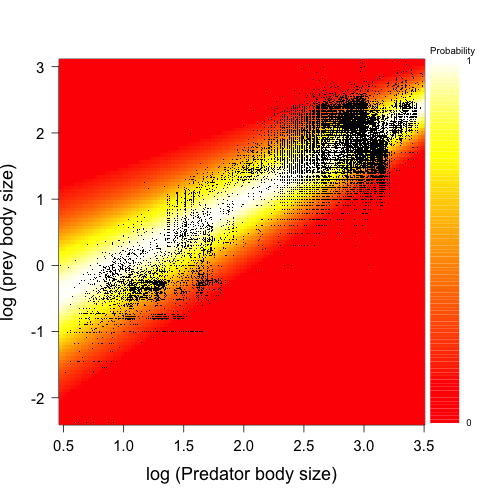

We can see in this case that the estimates are similar, but that the slope (alpha1) is flatter and the range a bit wider. We can compare the accuracy of the integrated, niche and neutral models by comparing their likelihood. 


```r
# Compute likelihoods
lh_model <- -integrated_model(pars_pre, MPrey, MPred, mean(MPrey),sd(MPrey))
lh_niche <- -niche_model(pars_pre_niche, MPrey, MPred, mean(MPrey), sd(MPrey))
lh_neutral <- -neutral_model(pars = NULL, MPrey, MPred, mean(MPrey), sd(MPrey))

# Visualization
barplot(c(lh_model, lh_niche, lh_neutral), names.arg = c("integrated", "niche", "neutral"))
```


```r
l1 <- c("Predation", lh_model, lh_niche, lh_neutral)
```

In this case, the integrated model is slightly better than the niche model, and the neutral model the worst.

Now we do the same for grasshopper hervibore data.


```r
# Load data for grasshoppers
#grass <- read.table("data/Deraison2014.txt", h = TRUE)
grass <- Deraison2014
head(grass)
```

```
##   Plant.species Grasshopper.species  Herbivory G.Body.size.mm
## 1        ACHMIL                  Ci 81.6666667          18.25
## 2        ACHMIL                  Cd  5.6250000          15.76
## 3        ARRELA                  Cb 53.6666667          14.69
## 4        ARRELA                  Cd 59.9305556          15.76
## 5        ARRELA                  Ci  7.6000000          18.25
## 6        ARRELA                  Pg  0.2380952          11.38
##   G.Incisive.strength G.Carbon.nitrogen.ratio         G.Species.name
## 1                0.06                    3.85   Calliptamus italicus
## 2                0.10                    4.13   Chorthippus dorsatus
## 3                0.09                    4.00 Chorthippus biguttulus
## 4                0.10                    4.13   Chorthippus dorsatus
## 5                0.06                    3.85   Calliptamus italicus
## 6                0.05                    4.30    Pezotettix giornae 
##   P.Leaf.dry.matter.content P.Leaf.nitrogen.content.dry.mass
## 1                  19.23454                         1.992143
## 2                  19.23454                         1.992143
## 3                  31.58509                         2.938487
## 4                  31.58509                         2.938487
## 5                  31.58509                         2.938487
## 6                  31.58509                         2.938487
##   P.Leaf.carbon.content.dry.mass P.Leaf.carbon.nitrogen.ratio
## 1                       43.20417                     21.68729
## 2                       43.20417                     21.68729
## 3                       45.08585                     15.34322
## 4                       45.08585                     15.34322
## 5                       45.08585                     15.34322
## 6                       45.08585                     15.34322
##   P.Leaf.thickness.mm P.Leaf.area.cm P.Perimeter.leaf.lenght.ratio
## 1           0.3446543       8.210625                      3.110526
## 2           0.3446543       8.210625                      3.110526
## 3           0.1268985      15.728450                      2.091292
## 4           0.1268985      15.728450                      2.091292
## 5           0.1268985      15.728450                      2.091292
## 6           0.1268985      15.728450                      2.091292
##          P.Species.name
## 1 Achillea  millefolium
## 2 Achillea  millefolium
## 3 Arrhenatherum elatius
## 4 Arrhenatherum elatius
## 5 Arrhenatherum elatius
## 6 Arrhenatherum elatius
```

```r
# As is experimental data, we subset only the "presences" for illustrative purposes.
grass <- subset(grass, Herbivory > 0)

# We first fit a binary model, interaction/no interaction.
pars_grass_bin <- fit_it(integrated_model,
                         Tlevel1 = grass$P.Leaf.dry.matter.content, 
                         Tlevel2 = grass$G.Incisive.strength,
                         mean_Tlevel1 = mean(grass$P.Leaf.dry.matter.content),
                         sd_Tlevel1 = sd(grass$P.Leaf.dry.matter.content),
                         max.time = mt)
```

```
## It: 1, obj value: 213.838594
## ........................................................................
## It: 4, obj value: 213.8166969
## .......
## It: 32, obj value: 213.8165794
## ........................................................................................................................................................................................................................................................................................................................It: 1, obj value: 213.8165792
## ................................................................................................................................................................................................................................................................................................................................It: 1, obj value: 213.8165785
## ..............................................................................................
## It: 377, obj value: 213.8165742
## .........................................................................................................................................................
## It: 989, obj value: 213.8165719
## .........................................
```

```r
# Note that in this case we use the default pars, which are quite unconstrained, but work well in this case.
pars_grass_bin
```

```
## [1]  -119.3891  1475.4906   138.0088 -1077.8793
```

```r
plot_pred(pars = pars_grass_bin, Tlevel1 = jitter(grass$P.Leaf.dry.matter.content), 
          Tlevel2 = jitter(grass$G.Incisive.strength), xlab = "Incisive strength",
          ylab = "Leaf dry matter content")
```

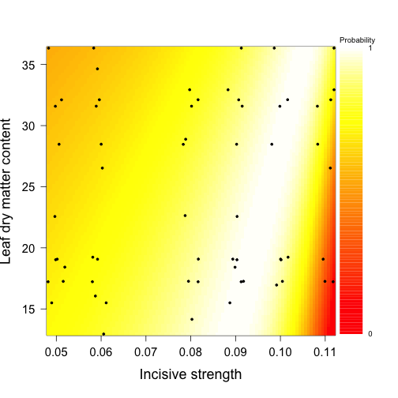

```r
# Compare with the likelihood of the three models
pars_grass_bin_niche = fit_it(niche_model, 
                   Tlevel1 = grass$P.Leaf.dry.matter.content, 
                   Tlevel2 = grass$G.Incisive.strength,
                   mean_Tlevel1 = mean(grass$P.Leaf.dry.matter.content),
                   sd_Tlevel1 = sd(grass$P.Leaf.dry.matter.content),
                   max.time = mt)
```

```
## It: 1, obj value: 318.6600368
## .
## It: 1001, obj value: 318.6600351
## .
## It: 1005, obj value: 318.6600349
## .........................
## It: 1105, obj value: 318.6600349
## ...................
## It: 1181, obj value: 318.6600346
## ...................................................
## It: 104, obj value: 318.6600344
## ......................................................................................................................................................................................................................................................................................................................................................................................................................................................................................................................................................................................................................................................................................................................................................................................................................................................................................................................................
```

```r
# Plot_pred(pars = pars_grass_bin_niche, Tlevel1 = jitter(grass$P.Leaf.dry.matter.content), 
#         Tlevel2 = jitter(grass$G.Incisive.strength), xlab = "Incisive strength", ylab = "Leaf dry matter content")

# Likelihoods
lh_model <- -integrated_model(pars_grass_bin, grass$P.Leaf.dry.matter.content, 
                              grass$G.Incisive.strength, 
                              mean(grass$P.Leaf.dry.matter.content), 
                              sd(grass$P.Leaf.dry.matter.content))
lh_niche <- -niche_model(pars_grass_bin_niche, grass$P.Leaf.dry.matter.content, 
                         grass$G.Incisive.strength, 
                         mean(grass$P.Leaf.dry.matter.content), 
                         sd(grass$P.Leaf.dry.matter.content))
lh_neutral <- -neutral_model(pars = NULL, grass$P.Leaf.dry.matter.content, grass$G.Incisive.strength, 
                             mean(grass$P.Leaf.dry.matter.content), 
                             sd(grass$P.Leaf.dry.matter.content))

barplot(c(lh_model, lh_niche, lh_neutral), names.arg = c("integrated", "niche", "neutral"))
```


```r
l2 <- c("Hervibory_bin", lh_model, lh_niche, lh_neutral)

# Here the integrated is as good as the neutral model.

# Now we test the same data taking into account the frequency of interactions.

# Prepare the data
head(grass)
```

```
##   Plant.species Grasshopper.species  Herbivory G.Body.size.mm
## 1        ACHMIL                  Ci 81.6666667          18.25
## 2        ACHMIL                  Cd  5.6250000          15.76
## 3        ARRELA                  Cb 53.6666667          14.69
## 4        ARRELA                  Cd 59.9305556          15.76
## 5        ARRELA                  Ci  7.6000000          18.25
## 6        ARRELA                  Pg  0.2380952          11.38
##   G.Incisive.strength G.Carbon.nitrogen.ratio         G.Species.name
## 1                0.06                    3.85   Calliptamus italicus
## 2                0.10                    4.13   Chorthippus dorsatus
## 3                0.09                    4.00 Chorthippus biguttulus
## 4                0.10                    4.13   Chorthippus dorsatus
## 5                0.06                    3.85   Calliptamus italicus
## 6                0.05                    4.30    Pezotettix giornae 
##   P.Leaf.dry.matter.content P.Leaf.nitrogen.content.dry.mass
## 1                  19.23454                         1.992143
## 2                  19.23454                         1.992143
## 3                  31.58509                         2.938487
## 4                  31.58509                         2.938487
## 5                  31.58509                         2.938487
## 6                  31.58509                         2.938487
##   P.Leaf.carbon.content.dry.mass P.Leaf.carbon.nitrogen.ratio
## 1                       43.20417                     21.68729
## 2                       43.20417                     21.68729
## 3                       45.08585                     15.34322
## 4                       45.08585                     15.34322
## 5                       45.08585                     15.34322
## 6                       45.08585                     15.34322
##   P.Leaf.thickness.mm P.Leaf.area.cm P.Perimeter.leaf.lenght.ratio
## 1           0.3446543       8.210625                      3.110526
## 2           0.3446543       8.210625                      3.110526
## 3           0.1268985      15.728450                      2.091292
## 4           0.1268985      15.728450                      2.091292
## 5           0.1268985      15.728450                      2.091292
## 6           0.1268985      15.728450                      2.091292
##          P.Species.name
## 1 Achillea  millefolium
## 2 Achillea  millefolium
## 3 Arrhenatherum elatius
## 4 Arrhenatherum elatius
## 5 Arrhenatherum elatius
## 6 Arrhenatherum elatius
```

```r
Incisive.strength <- c()
for(i in 1:nrow(grass)){
  temp <- rep(grass$G.Incisive.strength[i], round(grass$Herbivory[i]))
  Incisive.strength <- c(Incisive.strength,temp)
}
Dry.matter <- c()
for(i in 1:nrow(grass)){
  temp <- rep(grass$P.Leaf.dry.matter.content[i], round(grass$Herbivory[i]))
  Dry.matter <- c(Dry.matter,temp)
}

# Fit models
pars_grass_freq <- fit_it(integrated_model,
                         Tlevel1 = Dry.matter, 
                         Tlevel2 = Incisive.strength,
                         mean_Tlevel1 = mean(grass$P.Leaf.dry.matter.content),
                         sd_Tlevel1 = sd(grass$P.Leaf.dry.matter.content),
                         max.time = mt)
```

```
## It: 1, obj value: 5383.703498
## ...
## It: 1009, obj value: 5383.703496
## ..
## It: 1017, obj value: 5383.703483
## ..................................................................................................................................
## It: 256, obj value: 5383.703481
## ....................................
```

```r
# Note the distribution (mean and standard deviation) is unweigthed because the experiment had equal abundances of plant species. We can use this knowledge to atribute each plant equal weight.
pars_grass_freq
```

```
## [1] -15.985483 530.276111   3.757514  65.781025
```

```r
plot_pred(pars = pars_grass_freq, Tlevel1 = jitter(Dry.matter,100), 
          Tlevel2 = jitter(Incisive.strength), xlab = "Incisive strength", ylab = "Leaf dry matter content")
```

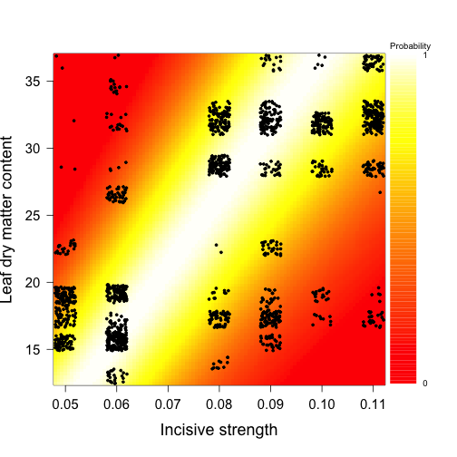

```r
# Compare models
pars_grass_freq_niche <- fit_it(niche_model, 
                                Tlevel1 = Dry.matter, 
                                Tlevel2 = Incisive.strength,
                                mean_Tlevel1 = mean(grass$P.Leaf.dry.matter.content),
                                sd_Tlevel1 = sd(grass$P.Leaf.dry.matter.content),
                                max.time = mt)
```

```
## It: 1, obj value: 8211.443085
## ........
## It: 1029, obj value: 8211.443078
## ..
## It: 1037, obj value: 8211.443077
## ................
## It: 1101, obj value: 8211.443073
## ...................................................................................................................................
## It: 344, obj value: 8211.44307
## .............................................................
## It: 588, obj value: 8211.443068
## .............................................
```

```r
# plot_pred(pars = pars_grass_freq_niche, Tlevel1 = jitter(Dry.matter,100), 
#        Tlevel2 = jitter(Incisive.strength), xlab = "Incisive strength", ylab = "Leaf dry matter content")

# Likelihood
lh_model <- -integrated_model(pars_grass_freq, Dry.matter, Incisive.strength, 
                              mean(grass$P.Leaf.dry.matter.content), 
                              sd(grass$P.Leaf.dry.matter.content))
lh_niche <- -niche_model(pars_grass_freq_niche, Dry.matter, Incisive.strength, 
                         mean(grass$P.Leaf.dry.matter.content), 
                         sd(grass$P.Leaf.dry.matter.content))
lh_neutral <- -neutral_model(pars = NULL, Dry.matter, Incisive.strength, 
                             mean(grass$P.Leaf.dry.matter.content),
                             sd(grass$P.Leaf.dry.matter.content))

# Visualization
barplot(c(lh_model, lh_niche, lh_neutral), names.arg = c("integrated", "niche", "neutral"))
```

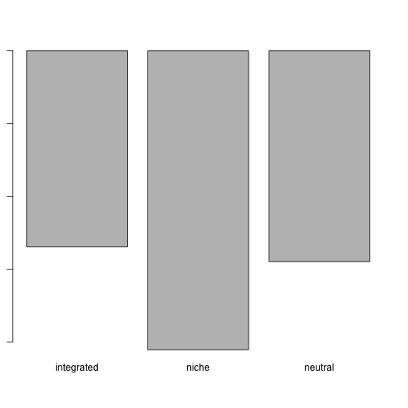

```r
l3 <- c("Hervibory_freq", lh_model, lh_niche, lh_neutral)
```

And here is the code for the plants and pollinators:


```r
# Read data
#pols  <-  read.table("data/Bartomeus2008.txt", h = TRUE)
pols <- Bartomeus2008
head(pols)
```

```
##                 plant nectar_holder_depth_mm           pollinator IT_mm
## 1 Aetheorhiza_bulbosa                      2            Nomada_sp  1.57
## 2 Aetheorhiza_bulbosa                      2      Lasioglossum_sp  1.36
## 3 Aetheorhiza_bulbosa                      2 Lasioglossum_gemmeus  1.33
## 4 Aetheorhiza_bulbosa                      2      Andrena_cinerea  2.22
## 5 Aetheorhiza_bulbosa                      2      Andrena_cinerea  2.15
## 6 Allium_ampeloprasum                      1          Halictus_sp  1.15
##       family      cover
## 1     Apidae 2.29166667
## 2 Halictidae 2.29166667
## 3 Halictidae 2.29166667
## 4 Andrenidae 2.29166667
## 5 Andrenidae 2.29166667
## 6 Halictidae 0.04166667
```

```r
# Transform body size to tongue lenght first based on Cariveau et al. Submitted.
require(devtools)
install_github("BeeIT", "ibartomeus") #just once
```

```
## Warning: Username parameter is deprecated. Please use ibartomeus/BeeIT
```

```
## Downloading GitHub repo ibartomeus/BeeIT@master
```

```
## Installing BeeIT
```

```
## '/Library/Frameworks/R.framework/Resources/bin/R' --no-site-file  \
##   --no-environ --no-save --no-restore CMD INSTALL  \
##   '/private/var/folders/p4/d9_l6vqs0jdf5f1cyk7cy4sc0000gp/T/RtmpZIx1tt/devtools54ef24528410/ibartomeus-BeeIT-b72985a'  \
##   --library='/Library/Frameworks/R.framework/Versions/3.1/Resources/library'  \
##   --install-tests
```

```
## 
```

```r
library(BeeIT)
head(pols)
```

```
##                 plant nectar_holder_depth_mm           pollinator IT_mm
## 1 Aetheorhiza_bulbosa                      2            Nomada_sp  1.57
## 2 Aetheorhiza_bulbosa                      2      Lasioglossum_sp  1.36
## 3 Aetheorhiza_bulbosa                      2 Lasioglossum_gemmeus  1.33
## 4 Aetheorhiza_bulbosa                      2      Andrena_cinerea  2.22
## 5 Aetheorhiza_bulbosa                      2      Andrena_cinerea  2.15
## 6 Allium_ampeloprasum                      1          Halictus_sp  1.15
##       family      cover
## 1     Apidae 2.29166667
## 2 Halictidae 2.29166667
## 3 Halictidae 2.29166667
## 4 Andrenidae 2.29166667
## 5 Andrenidae 2.29166667
## 6 Halictidae 0.04166667
```

```r
pols$tongue <- ITtongue(pols$IT_mm,pols$family , mouthpart = "tongue")

#plot(pols$tongue, pols$IT_mm) #see the relationship if interested
#subset the plant data for later use.
plants <- unique(pols[,c("plant", "nectar_holder_depth_mm", "cover")])

# Fit models
pars_pols <- fit_it(integrated_model,
                    Tlevel1 = pols$nectar_holder_depth_mm, 
                      Tlevel2 = log(pols$tongue),
                    mean_Tlevel1 = weighted_mean(plants$nectar_holder_depth_mm, plants$cover),
                    sd_Tlevel1 = weighted_sd(plants$nectar_holder_depth_mm, plants$cover),
                    max.time = mt)
```

```
## It: 1, obj value: 755.332323
## It: 2, obj value: 752.0441056
## It: 109, obj value: 735.0677243
## ....................................................
## It: 32, obj value: 735.0677238
## .............
## It: 84, obj value: 710.9343245
## ................................
## It: 212, obj value: 707.8971237
## .................
## It: 280, obj value: 706.4293179
## .............
## It: 332, obj value: 705.9406187
## ............................................................................................................................................................................................................................................................................................................................................................................................................................................
```

```r
# Note that here we have independent data on plant abundance (% cover). Hence we can use this data directly to fit the model.
# If interested, you can see that the inference from the network, is quite similar to the real cover 
#plot(dnorm(x = seq(-7,10,1), weighted_mean(plants$nectar_holder_depth_mm, plants$cover), 
 #     weighted_sd(plants$nectar_holder_depth_mm, plants$cover)), col = "red", type = "l")
#par(new = TRUE)
#plot(dnorm(x = seq(-7,10,1), mean(pols$nectar_holder_depth_mm), 
 #     sd(pols$nectar_holder_depth_mm)), col = "blue", type = "l")

plot_pred(pars = pars_pols, Tlevel1 = jitter(pols$nectar_holder_depth_mm, 10), 
          Tlevel2 = log(pols$tongue), xlab = "log(Pollinator tongue size)", ylab = "Nectar depth")
```

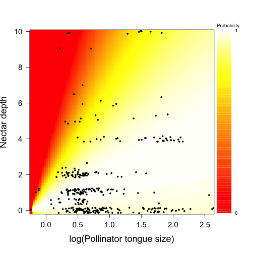

```r
# Model comparision
pars_pol_niche = fit_it(niche_model, 
                   Tlevel1 = pols$nectar_holder_depth_mm, 
                   Tlevel2 = log(pols$tongue),
                   mean_Tlevel1 = weighted_mean(plants$nectar_holder_depth_mm, plants$cover),
                   sd_Tlevel1 = weighted_sd(plants$nectar_holder_depth_mm, plants$cover),
                   max.time = mt)
```

```
## It: 1, obj value: 1010.46427
## .
## It: 1001, obj value: 1010.464268
## .
## It: 1005, obj value: 1010.464264
## ......................................
## It: 1157, obj value: 1010.464263
## ..................................................................................................................................................................
## It: 524, obj value: 1010.464263
## ..................................................................
## It: 788, obj value: 1010.464263
## ...........................................................................................................................................................................................................................................................................................................................................................................
## It: 959, obj value: 1010.464263
## ............................................................................................................................................................................................................................................................................................
## It: 814, obj value: 1010.464263
## ....................................................................................
```

```r
plot_pred(pars = pars_pol_niche, Tlevel1 = jitter(pols$nectar_holder_depth_mm, 10), 
          Tlevel2 = log(pols$tongue), xlab = "log(Pollinator tongue size)", ylab = "Nectar depth")
```

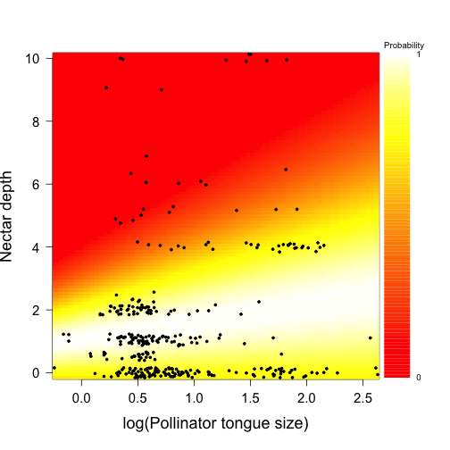

```r
# Likelihood
lh_model <- -integrated_model(pars_pols, pols$nectar_holder_depth_mm, log(pols$tongue), 
                              weighted_mean(plants$nectar_holder_depth_mm, plants$cover), 
                              weighted_sd(plants$nectar_holder_depth_mm, plants$cover))
lh_niche <- -niche_model(pars_pol_niche, pols$nectar_holder_depth_mm, log(pols$tongue), 
                         weighted_mean(plants$nectar_holder_depth_mm, plants$cover),
                         sd(pols$nectar_holder_depth_mm))
lh_neutral <- -neutral_model(pars = NULL, pols$nectar_holder_depth_mm, log(pols$tongue), 
                             weighted_mean(plants$nectar_holder_depth_mm, plants$cover),
                             weighted_sd(plants$nectar_holder_depth_mm, plants$cover))

barplot(c(lh_model, lh_niche, lh_neutral), names.arg = c("integrated", "niche", "neutral"))
```

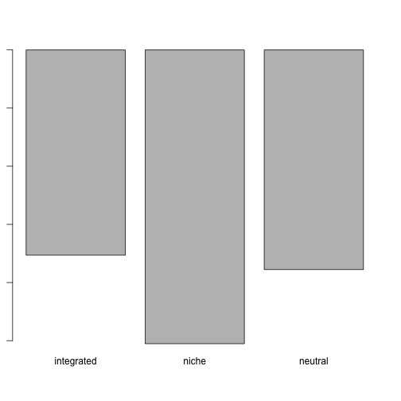

```r
l5 <- c("Pollintion", lh_model, lh_niche, lh_neutral)
```

Hosts and parasitoids. An example that doesn't work as well.


```r
# Read and format data
#host  <-  read.table("data/Tylianakis2008.txt", h = TRUE)
host  <-  Tylianakis2008
head(host)
```

```
##   parasite    host freq host_body_length parasite_body_length
## 1   Antgru    Zeta    1        15.225000                 11.0
## 2   Antgru  Sphec3    1        10.100000                 11.0
## 3    Bomby Pseudod    2         8.068421                  7.2
## 4    Bomby    Zeta    4        15.225000                  7.2
## 5    Bomby  Sphec2    1         8.000000                  7.2
## 6    Bomby Pseudod    1         8.068421                  7.2
```

```r
host_body_length <- c()
for(i in 1:nrow(host)){
  temp <- rep(host$host_body_length[i], host$freq[i])
  host_body_length <- c(host_body_length, temp)
}
parasite_body_length <- c()
for(i in 1:nrow(host)){
  temp <- rep(host$parasite_body_length[i], host$freq[i])
  parasite_body_length <- c(parasite_body_length,temp)
}

# Fit models
pars_host <- fit_it(integrated_model,
                        Tlevel1 = host_body_length, 
                        Tlevel2 = parasite_body_length,
                        mean_Tlevel1 = weighted_mean(host$host_body_length, host$freq),
                        sd_Tlevel1 = weighted_sd(host$host_body_length, host$freq),
                        par_lo = c(a0 = 0, a1 = -10, b0 = -10, b1 = -10),
                        par_hi = c(a0 = 10, a1 = 0, b0 = 10, b1 = 10),
                        max.time = mt)
```

```
## It: 1, obj value: 7383.126971
## .........
## It: 1033, obj value: 7383.126229
## .
## It: 1037, obj value: 7383.126204
## .............................................................It: 1, obj value: 7383.126197
## ...........................................................................................................................................................
```

```r
# With unconstrained parameters, the model behaves weirdly, so we have to constrain the values to sensible limits. You can do that by looking at x and y axes ranges and think which slope values are possible.
pars_host
```

```
## [1]  9.99998988 -0.07975137 -7.95688520  9.99920562
```

```r
plot_pred(pars = pars_host, Tlevel1 = jitter(host_body_length), 
          Tlevel2 = jitter(parasite_body_length), xlab = "Parasite body size", ylab = "Host body size")
```

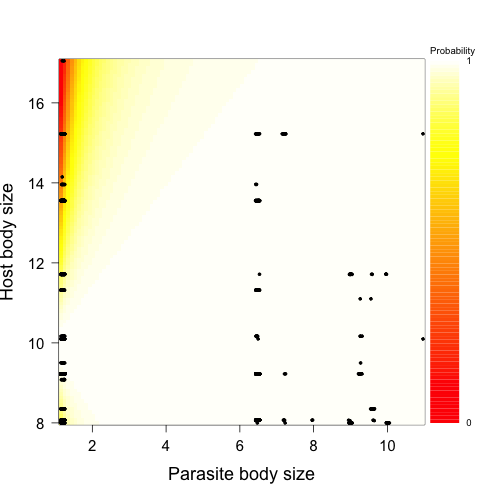

```r
# As you can see everything is predicted.

# Model comparison 
pars_host_niche <- fit_it(niche_model,
                    Tlevel1 = host_body_length, 
                    Tlevel2 = parasite_body_length,
                    mean_Tlevel1 = weighted_mean(host$host_body_length, host$freq),
                    sd_Tlevel1 = weighted_sd(host$host_body_length, host$freq),
                    par_lo = c(a0 = 0, a1 = -10, b0 = -10, b1 = -10),
                    par_hi = c(a0 = 10, a1 = 0, b0 = 10, b1 = 10),
                    max.time = mt)
```

```
## It: 1, obj value: 10268.99984
## ..
## It: 1005, obj value: 10268.9998
## .......
## It: 1033, obj value: 10268.99977
## .............................................................................................................................................................................................................................................................
## It: 764, obj value: 10268.99977
## ..........................................
## It: 932, obj value: 10268.99977
## ......................................................................................................................................................................................................................................................................................................................................................................................................................................................................................................................................................................................................................................................................................................................
```

```r
plot_pred(pars = pars_host_niche, Tlevel1 = host_body_length, 
          Tlevel2 = parasite_body_length, xlab = "Parasite body size", ylab = "Host body size")
```

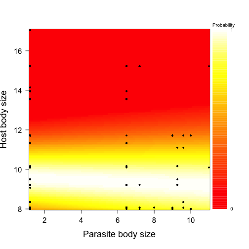

```r
# Likelihoods
lh_model <- -integrated_model(pars_host, host_body_length, parasite_body_length, 
                              weighted_mean(host$host_body_length, host$freq), 
                              weighted_sd(host$host_body_length, host$freq))
lh_niche <- -niche_model(pars_host_niche, host_body_length, parasite_body_length, 
                         weighted_mean(host$host_body_length, host$freq), 
                         weighted_sd(host$host_body_length, host$freq))
lh_neutral <- -neutral_model(pars = NULL, host_body_length, parasite_body_length, 
                             weighted_mean(host$host_body_length, host$freq), 
                             weighted_sd(host$host_body_length, host$freq))

barplot(c(lh_model, lh_niche, lh_neutral), names.arg = c("integrated", "niche", "neutral"))
```

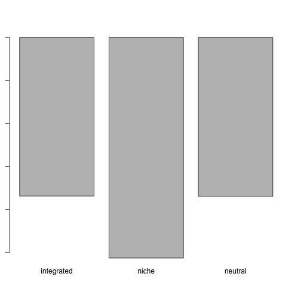

```r
l4 <- c("Parasitsim", lh_model, lh_niche, lh_neutral)
```
Thats's it. You can also gather a summary table of parameters and likelihoods for all the models you have run:


```r
# Table of likelihoods
d <- rbind(l1,l2,l3,l4,l5)
d <- as.data.frame(d)
colnames(d) <- c("system", "integrated", "niche", "neutral")
d
```

```
##            system        integrated             niche           neutral
## l1      Predation -21223.0582493077 -28353.9630486358 -40884.1912361719
## l2  Hervibory_bin -213.816571854573 -318.660034447101 -214.409476596947
## l3 Hervibory_freq -5383.70348108761 -8211.44306823812 -5792.05186329847
## l4     Parasitsim -7383.12619691495 -10268.9997693487 -7397.40700396424
## l5     Pollintion -705.940618749187 -1010.46426269516 -755.326221959182
```

```r
dd <- rbind(pars_pre, pars_pre_niche, pars_grass_bin, pars_grass_bin_niche, pars_grass_freq, 
            pars_grass_freq_niche, pars_host, pars_host_niche, pars_pols, pars_pol_niche)
dd <- as.data.frame(dd)
colnames(dd) <- c("a0", "a1", "b0", "b1")
dd
```

```
##                                 a0            a1          b0            b1
## pars_pre                -2.3883887    1.54533094   0.3103664  1.050232e-01
## pars_pre_niche          -0.8626257    0.92909052   0.8394806 -1.501566e-01
## pars_grass_bin        -119.3891223 1475.49060548 138.0088007 -1.077879e+03
## pars_grass_bin_niche    21.4680622   37.94298014   7.7918569 -7.013566e+00
## pars_grass_freq        -15.9854828  530.27611135   3.7575142  6.578102e+01
## pars_grass_freq_niche    7.1276808  217.19219101   3.2631219  3.098564e+01
## pars_host                9.9999899   -0.07975137  -7.9568852  9.999206e+00
## pars_host_niche          9.6160762   -0.04055992   1.3297158  5.866024e-02
## pars_pols                0.3368108    1.39546407   1.3088809  5.422915e+00
## pars_pol_niche           1.0558738    0.52600392   1.4165556  7.262638e-01
```

